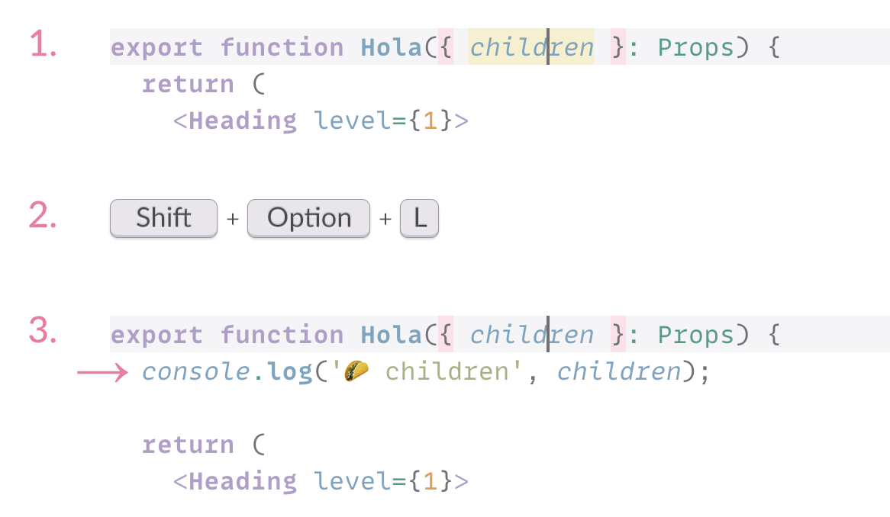

# Emoji Console Log Visual Studio Code extension 🦆

Visual Studio Code extension to insert `console.log()` statement with a random emoji and a variable (object, function, etc.) under your cursor to make debugging JavaScript and TypeScript code easier.

**Install from [Visual Studio Marketplace](https://marketplace.visualstudio.com/items?itemName=sapegin.emoji-console-log) or [Open VSX Registry](https://open-vsx.org/extension/sapegin/emoji-console-log)**



_This is a fork of the [Turbo Console Log](https://www.turboconsolelog.io) extension, [see more details below](#motivation)._

[](https://sapegin.me/book/)

## Features

- Hotkeys to add, comment, uncomment, and remove logs to monitor different values.
- Adds random non-repeating emoji to each log to make it easier to distinguish different logs in the browser console.
- Automatically detects project’s code style (quotes, semicolons, tabs/spaces, etc.).
- Automagically adds new lines at the right places to keep the code neat.

This extension adds four commands to your Visual Studio Code:

### Insert a log message

Place a cursor at or select a variable that you want to log, and press <kbd>Shift</kbd>+<kbd>Option</kbd>+<kbd>L</kbd> (Mac) or <kbd>Shift</kbd>+<kbd>Alt</kbd>+<kbd>L</kbd> (Windows). A log message will be inserted at the next line like so:

```js
console.log('🦆 variable', variable);
```

When there’s no recognized symbol under the cursor, the extension adds an “empty” log:

```js
console.log('🦊');
```

### Comment all log messages, inserted by the extension, in the open file

Press <kbd>Shift</kbd>+<kbd>Option</kbd>+<kbd>C</kbd> (Mac) or <kbd>Shift</kbd>+<kbd>Alt</kbd>+<kbd>C</kbd> (Windows).

### Uncomment all log messages, inserted by the extension, in the open file

Press <kbd>Shift</kbd>+<kbd>Option</kbd>+<kbd>U</kbd> (Mac) or <kbd>Shift</kbd>+<kbd>Alt</kbd>+<kbd>U</kbd> (Windows).

### Delete all log messages, inserted by the extension, in the open file

Press <kbd>Shift</kbd>+<kbd>Option</kbd>+<kbd>D</kbd> (Mac) or <kbd>Shift</kbd>+<kbd>Alt</kbd>+<kbd>D</kbd> (Windows).

## Settings

You can change the following options in the [Visual Studio Code setting](https://code.visualstudio.com/docs/getstarted/settings):

| Description | Setting | Default |
| --- | --- | --- |
| Log function to use in the inserted log message | `emojiConsoleLog.logFunction` | `console.log` |

You can also [redefine the key bindings](https://code.visualstudio.com/docs/getstarted/keybindings):

| Description | Name | Default Mac | Default Windows |
| --- | --- | --- | --- |
| Insert a log message | `emojiConsoleLog.addLogMessage` | <kbd>Shift</kbd>+<kbd>Option</kbd>+<kbd>L</kbd> | <kbd>Shift</kbd>+<kbd>Alt</kbd>+<kbd>L</kbd> |
| Comment all log messages | `emojiConsoleLog.commentAllLogMessages` | <kbd>Shift</kbd>+<kbd>Option</kbd>+<kbd>C</kbd> | <kbd>Shift</kbd>+<kbd>Alt</kbd>+<kbd>C</kbd> |
| Uncomment all log messages | `emojiConsoleLog.uncommentAllLogMessages` | <kbd>Shift</kbd>+<kbd>Option</kbd>+<kbd>U</kbd> | <kbd>Shift</kbd>+<kbd>Alt</kbd>+<kbd>U</kbd> |
| Delete all log messages | `emojiConsoleLog.removeAllLogMessages` | <kbd>Shift</kbd>+<kbd>Option</kbd>+<kbd>D</kbd> | <kbd>Shift</kbd>+<kbd>Alt</kbd>+<kbd>D</kbd> |

## Motivation

Using `console.log()` is my favorite way of debugging JavaScript and TypeScript code. I’ve been trying to learn more fancy techniques, like a debugger, but I always come back to `console.log()`, because it’s the simplest and it works for me.

The way I do it is by adding a separate log for each variable I want to track, like so: `console.log('🍕 variable', variable)`. I always add a different emoji at the beginning, so it’s easy to differentiate logs in the browser console.

I wanted the easiest way to manage such logs so I found the [Turbo Console Log](https://www.turboconsolelog.io) extension that does most of what I wanted but not in a way I’d like. I decided to make a fork instead of contributing more options to the original extension because I felt my vision would be very different from the vision of the original extension.

The main differences with Turbo Console Log are:

- Significantly simpler and doesn’t come with a lot of options, doesn’t add class name, file name, line number, etc, only the variable name.
- Adds random non-repeating emoji to each log
- Automatically detects project’s code style (quotes, semicolons, tabs/spaces, etc.).
- Automagically add new lines at the right places.

## Changelog

The changelog can be found on the [Changelog.md](./Changelog.md) file.

## You may also like

Check out my other [Visual Studio Code extensions](https://github.com/sapegin/raccoon-vscode) and [themes](https://sapegin.me/squirrelsong/).

## Sponsoring

This software has been developed with lots of coffee, buy me one more cup to keep it going.

<a href="https://www.buymeacoffee.com/sapegin" target="_blank"></a>

## Contributing

Bug fixes are welcome, but not new features. Please take a moment to review the [contributing guidelines](../../Contributing.md).

## Authors and license

[Artem Sapegin](https://sapegin.me), and [contributors](https://github.com/sapegin/raccoon-vscode/graphs/contributors).

This extension is based on [Turbo Console Log](https://github.com/Chakroun-Anas/turbo-console-log) by [Chakroun Anas](https://github.com/Chakroun-Anas) and its [contributors](https://github.com/Chakroun-Anas/turbo-console-log/graphs/contributors).

MIT License, see the included [License.md](License.md) file.
