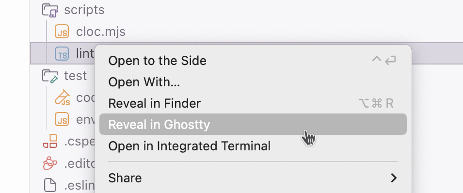
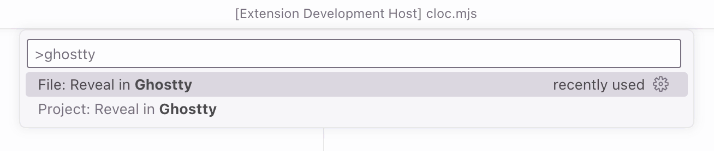

# Reveal in… 📂

Reveal current project or folder in external apps:

- [Ghostty](https://ghostty.org/)
- [GitHub Desktop](https://github.com/apps/desktop)
- [Nimble Commander](https://magnumbytes.com)

## Commands

You can either run this commands from the Command Palette (<kbd>Cmd</kbd>+<kbd>Shift</kbd>+<kbd>P</kbd> on a Mac, or <kbd>Ctrl</kbd>+<kbd>Shift</kbd>+<kbd>P</kbd> on Windows), or [assign hotkeys](https://code.visualstudio.com/docs/getstarted/keybindings).

| Name | Description |
| --- | --- |
| `revealIn.revealProjectGhostty` | Reveal project root folder in Ghostty |
| `revealIn.revealFileGhostty` | Reveal currently open folder in Ghostty |
| `revealIn.revealProjectGitHubDesktop` | Reveal project root folder in GitHub Desktop |
| `revealIn.revealProjectNimbleCommander` | Reveal project root folder in Nimble Commander |
| `revealIn.revealFileNimbleCommander` | Reveal currently open folder in Nimble Commander |

You can also access the commands via Explorer context menu.

## Changelog

The changelog can be found on the [Changelog.md](./Changelog.md) file.

## You may also like

Check out my other [Visual Studio Code extensions](https://github.com/sapegin/raccoon-vscode) and [themes](https://sapegin.me/squirrelsong/).

Additionally, check out [my theme for Ghostty](https://sapegin.me/squirrelsong/ghostty/).

## Sponsoring

This software has been developed with lots of coffee, buy me one more cup to keep it going.

## Contributing

Bug fixes are welcome, but not new features. Please take a moment to review the [contributing guidelines](../../Contributing.md).

## Authors and license

[Artem Sapegin](https://sapegin.me), and [contributors](https://github.com/sapegin/raccoon-vscode/graphs/contributors).

MIT License, see the included [License.md](License.md) file.
